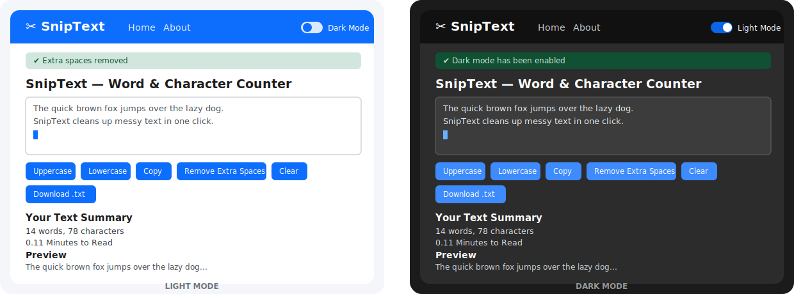
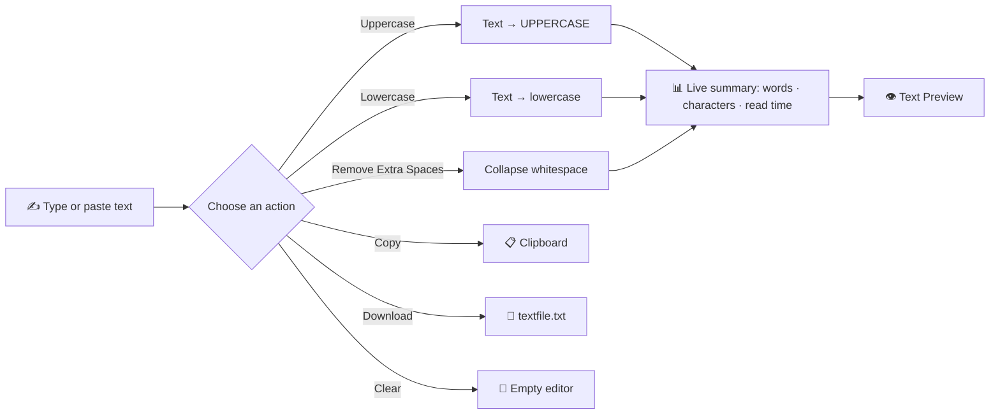
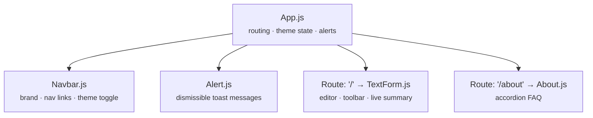

<div align="center">

# ✂️ SnipText

### A fast, clean, distraction-free word & character counter for the web.

<p>
  
  
  
  
</p>

<p>
  
  
  
</p>

**Paste your text. Snip away the noise. Get instant stats.**

[Features](#-features) • [Preview](#-preview) • [Getting Started](#-getting-started) • [Project Structure](#-project-structure) • [How It Works](#-how-it-works) • [Roadmap](#-roadmap) • [Contributing](#-contributing)

</div>

---

## 📖 About

**SnipText** is a lightweight React utility app for analyzing and cleaning up text on the fly. Paste anything — an essay, a caption, a blog draft — and instantly see the word count, character count, and estimated reading time, while one-click tools let you transform the text, tidy it up, and get it out the door (copied, downloaded, or ready to paste elsewhere).

No sign-up, no clutter, no ads. Just a textarea and the tools you actually need.

---

## ✨ Features

| | Feature | Description |
|---|---|---|
| 🔠 | **Case Conversion** | Instantly flip your text to `UPPERCASE` or `lowercase` |
| 🧹 | **Remove Extra Spaces** | Collapses repeated spaces into single spaces with one click |
| 📋 | **Copy to Clipboard** | Copies the current text using the Clipboard API |
| 💾 | **Download as .txt** | Exports your text as a downloadable `textfile.txt` |
| 🔢 | **Live Word & Character Count** | Updates in real time as you type |
| ⏱️ | **Reading Time Estimate** | Approximate minutes-to-read, calculated on the fly |
| 👁️ | **Live Preview** | See a rendered preview of your text below the editor |
| 🌗 | **Light / Dark Mode** | One-toggle theme switch across the whole app |
| 🔔 | **Toast Alerts** | Friendly, auto-dismissing feedback for every action |
| 🧭 | **Client-side Routing** | Home and About pages via React Router, no page reloads |
| 📱 | **Responsive UI** | Built on Bootstrap 5 — works from mobile to desktop |

---

## 🖼️ Preview

<div align="center">
  
  <p><em>Mockup of the SnipText interface — text editor, action toolbar, and live summary panel, in both themes.</em></p>
</div>

> 💡 Replace `assets/ui-preview.svg` with real screenshots or a GIF of the running app for an even better first impression.

---

## 🧠 How It Works



Every keystroke recalculates the word count, character count, and estimated reading time (`words × 0.008` minutes) — no submit button, no delay.

---

## 🏗️ Architecture



| Component | Responsibility |
|---|---|
| `App.js` | Top-level state (`mode`, `alert`), routing via `react-router-dom` |
| `Navbar.js` | Branding, navigation links, dark/light mode switch |
| `TextForm.js` | The core editor: textarea, all text-transform actions, live stats |
| `Alert.js` | Renders a Bootstrap alert whenever an action fires `showAlert()` |
| `About.js` | Bootstrap accordion explaining what SnipText does |

---

## 🛠️ Tech Stack

<p>
  
  
  
  
  
</p>

- **React 19** — component-driven UI with hooks (`useState`)
- **React Router 7** — client-side navigation between Home and About
- **Bootstrap 5** — layout, buttons, accordion, and the responsive grid
- **Create React App** — zero-config build tooling (`react-scripts`)

---

## 🚀 Getting Started

### Prerequisites

- [Node.js](https://nodejs.org/) ≥ 16
- npm (bundled with Node) or yarn

### Installation

```bash
# 1. Clone the repository
git clone https://github.com/<your-username>/SnipText.git
cd SnipText

# 2. Install dependencies
npm install

# 3. Start the development server
npm start
```

The app will open automatically at **[http://localhost:3000](http://localhost:3000)**.

### Available Scripts

| Command | Description |
|---|---|
| `npm start` | Runs the app in development mode with hot reload |
| `npm test` | Launches the interactive test runner |
| `npm run build` | Bundles the app for production into `/build` |
| `npm run eject` | Ejects CRA config (⚠️ one-way operation) |

---

## 📁 Project Structure

```
SnipText/
├── public/
│   ├── index.html
│   ├── manifest.json
│   └── favicon assets
├── src/
│   ├── Components/
│   │   ├── Navbar.js       # Top navigation + theme toggle
│   │   ├── TextForm.js     # Main editor & text tools
│   │   ├── Alert.js        # Toast-style alert banner
│   │   └── About.js        # FAQ / accordion page
│   ├── App.js               # Routes, theme & alert state
│   ├── App.css
│   ├── index.js
│   └── index.css
├── package.json
└── README.md
```

---

## 🗺️ Roadmap

- [ ] Real screenshots / demo GIF in the README
- [ ] Speak-text (text-to-speech) button — scaffolding already in `TextForm.js`
- [ ] Sentence & paragraph count
- [ ] Persist theme preference (localStorage)
- [ ] Deploy a live demo (Vercel / Netlify) and link it here
- [ ] Unit tests for text-transform utilities

---

## 🤝 Contributing

Contributions, issues, and feature requests are welcome!

1. Fork the project
2. Create your feature branch (`git checkout -b feature/amazing-feature`)
3. Commit your changes (`git commit -m 'Add some amazing feature'`)
4. Push to the branch (`git push origin feature/amazing-feature`)
5. Open a Pull Request

---

## 📄 License

This project is licensed under the **MIT License** — feel free to use, modify, and distribute it.

---

<div align="center">

Made with ⚛️ React and ☕ by the Bhavik 

⭐ If you like this project, consider giving it a star!

</div>
